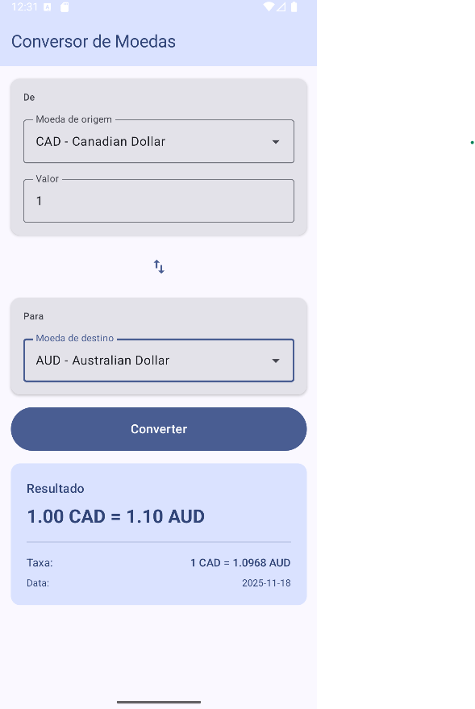

# Conversor de Moedas

Aplicativo Android para conversão de moedas em tempo real, utilizando a API Frankfurter.

## Descrição do App

O **Conversor de Moedas** é um aplicativo Android desenvolvido com as mais recentes tecnologias recomendadas pelo Google, permitindo que usuários consultem taxas de câmbio atualizadas e realizem conversões entre diferentes moedas de forma rápida e intuitiva.

### Funcionalidades Principais

- **Listagem de moedas disponíveis** - Carregamento automático de todas as moedas suportadas pela API
- **Conversão em tempo real** - Taxas de câmbio atualizadas instantaneamente
- **Troca rápida de moedas** - Botão para inverter moeda de origem e destino
- **Exibição detalhada** - Mostra valor convertido, taxa de câmbio e data da cotação
- **Interface moderna** - Design seguindo Material Design 3
- **Responsivo** - Adapta-se a diferentes tamanhos de tela
- **Modo escuro** - Suporte automático para tema claro/escuro do sistema

## Arquitetura do Projeto

O aplicativo segue a **arquitetura recomendada pela Google** (Clean Architecture + MVVM), garantindo separação de responsabilidades, testabilidade e manutenibilidade.

```
app/
├── data/
│   ├── model/           # Modelos de dados da API
│   │   ├── Currency.kt
│   │   └── ConversionRate.kt
│   ├── remote/          # Cliente da API
│   │   └── FrankfurterApi.kt
│   └── repository/      # Implementação dos repositórios
│       └── CurrencyRepositoryImpl.kt
│
├── domain/
│   ├── model/           # Modelos de domínio
│   │   └── ConversionResult.kt
│   └── repository/      # Interfaces dos repositórios
│       └── CurrencyRepository.kt
│
├── presentation/        # Camada de UI
│   ├── CurrencyScreen.kt
│   └── CurrencyViewModel.kt
│
├── di/                  # Injeção de dependências
│   └── AppModule.kt
│
└── ui/theme/            # Tema Material Design 3
    ├── Color.kt
    ├── Theme.kt
    └── Type.kt
```

### Camadas da Arquitetura

#### 1. **Data Layer** (Camada de Dados)
- **Responsabilidade**: Acesso a fontes de dados externas (API REST)
- **Componentes**:
    - `FrankfurterApi`: Interface Retrofit para comunicação com a API
    - `CurrencyRepositoryImpl`: Implementação concreta do repositório
    - Models: Classes de dados que representam as respostas da API

#### 2. **Domain Layer** (Camada de Domínio)
- **Responsabilidade**: Lógica de negócio e regras da aplicação
- **Componentes**:
    - `CurrencyRepository`: Interface que define o contrato do repositório
    - `ConversionResult`: Modelo de domínio para resultados de conversão

#### 3. **Presentation Layer** (Camada de Apresentação)
- **Responsabilidade**: Interface do usuário e gerenciamento de estado
- **Componentes**:
    - `CurrencyViewModel`: Gerencia o estado da UI e lógica de apresentação
    - `CurrencyScreen`: Interface do usuário em Jetpack Compose
    - `CurrencyUiState`: Classe de estado da UI

## 📸 Captura de Tela

### Resultado da Conversão

*Exibição do resultado com taxa de câmbio e data*

## API Utilizada

**Frankfurter API** - API gratuita de taxas de câmbio
- Base URL: `https://api.frankfurter.app/`
- Documentação: https://www.frankfurter.app/docs/

### Endpoints Utilizados

1. **GET /currencies**
    - Retorna lista de moedas disponíveis

2. **GET /latest?from={from}&to={to}&amount={amount}**
    - Retorna taxa de conversão atualizada

```bash
# Executar testes unitários
./gradlew test

# Executar testes instrumentados
./gradlew connectedAndroidTest
```

## 📖 Referências

### Documentação Oficial Google
- [Architecture Guide](https://developer.android.com/topic/architecture?hl=pt-br)
- [Jetpack Compose](https://developer.android.com/jetpack/compose?hl=pt-br)
- [ViewModel](https://developer.android.com/topic/libraries/architecture/viewmodel?hl=pt-br)
- [Repository Pattern](https://developer.android.com/codelabs/basic-android-kotlin-compose-add-repository?hl=pt-br)
- [Dependency Injection with Hilt](https://developer.android.com/training/dependency-injection/hilt-android?hl=pt-br)

### Bibliotecas
- [Retrofit](https://square.github.io/retrofit/)
- [OkHttp](https://square.github.io/okhttp/)
- [Dagger Hilt](https://dagger.dev/hilt/)
- [Material Design 3](https://m3.material.io/)

### API
- [Frankfurter API Documentation](https://www.frankfurter.app/docs/)
